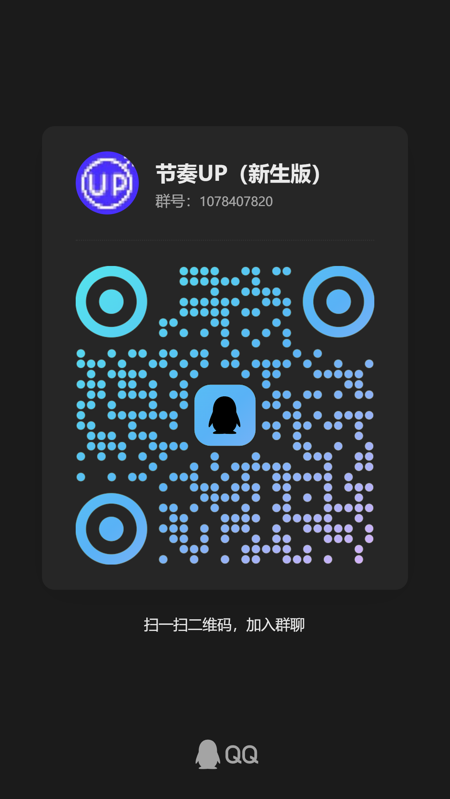

# 节奏天国

(Logo by 庞伙计phj)

## 这是什么？

这里是《节奏天国》汉化版的仓库，你可以用这里的文件编译出汉化版的游戏ROM，编译教程在[这里](BUILD_INSTRUCTION.md)

## 项目成员（随时更新）

> 排名不分先后

### 总监

- 阿斯特拉贡

### 程序

- Lunaland
- 阿斯特拉贡

### 中文本地化

- 庞伙计phj
- YL
- 神秘人Mystery
- 一袋冻柚子
- 阿斯特拉贡

### 美术

- 庞伙计phj
- Levi Highway
- lunar_dust月尘
- 阿斯特拉贡
- ~•VariableN2763•~ (Discord)
- arandomdude (Discord)

### 特别感谢

- 所有负责初代《节奏天国》的开发人员
- [Rhythm Heaven Advance](https://github.com/RHAdvance/RhythmHeavenAdvance)项目的维护者
- 负责[《节奏天国》反编译项目](https://github.com/arthurtilly/rhythmtengoku)的所有成员
- Tailx的[《节奏天国》资源包](https://github.com/Tailx501/RhythmHeavenResourcesPack)
- 以及热爱《节奏天国》系列的 **你**

## BUG反馈

## 免责声明

这是一个非官方的汉化项目，与任天堂没有任何关联、认可或合作。所有商标和版权均属于各自的原始所有者。

你不可以将此汉化用于商业目的。 

所有关于资源或源代码的权利均归原作者和任天堂所有。